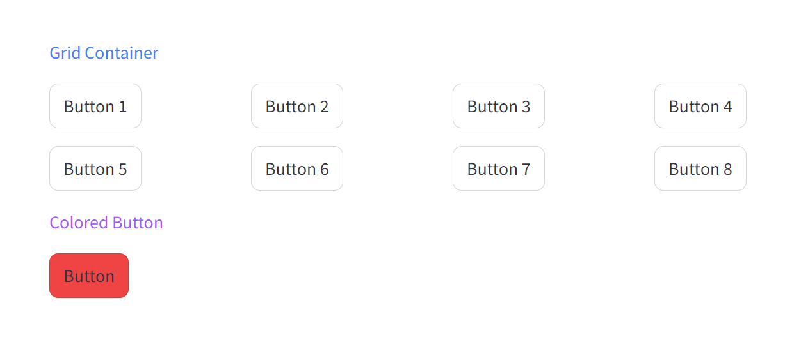

# Streamlit Tailwind

## If you find this project useful, please consider leaving a star <3

This project, Streamlit Tailwind, is designed to simplify the process of creating user interfaces. It provides a straightforward way to incorporate Tailwind CSS into your Streamlit
applications. So, without further ado:

## Install

Same as always, good ol' pip (or equivalents)

```sh
pip install st_tailwind
```

## Example



```python
import streamlit as st

import st_tailwind as tw

st.set_page_config("Streamlit Tailwind Examples")


def main():
    tw.initialize_tailwind()

    tw.write("Grid Container", classes="text-blue-500 pb-4")
    with tw.container(classes="grid grid-cols-4"):
        for idx in range(1, 9):
            st.button(f"Button {idx}")

    tw.write("Colored Button", classes="text-purple-500 pb-4")
    tw.button("Button", classes="bg-red-500")


if __name__ == "__main__":
    main()
```

## Usage

### Initialization

After configuring your page, call the initialize function so tailwind can be injected as a dependency.

```python
import streamlit as st

import st_tailwind as tw

st.set_page_config("Streamlit Tailwind Examples")

tw.initialize_tailwind()
```

### First way:

Use the tailwind wrapper components.

```python
import st_tailwind as tw

tw.selectbox("test", [], classes="w-fit")
```

### Second way:

Wrap the component yourself. You can add the `classes` keyword argument either in the wrapper method or on the wrapped method.

```python
import streamlit as st

from st_tailwind import tw_wrap

tw_wrap(st.selectbox, classes="w-fit")("test", [])
tw_wrap(st.selectbox)("test", [], classes="w-fit")
```
